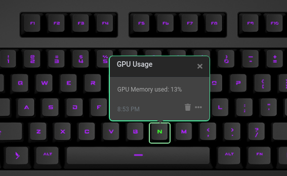

# Q Applet: GPU Usage

Monitors GPU memory usage on your Q keyboard.

[GitHub repository](https://github.com/brandonschabell/daskeyboard-applet-gpu-usage)

## Requirements

NVIDIA client software must be installed on your system.

**Windows:** Add `C:\Program Files\NVIDIA Corporation\NVSMI` to your PATH variable and restart the software.

## Example

The "N" key in the image below is green because the GPU memory usage is currently under 20%.

## Installation

Requires a Das Keyboard Q Series: www.daskeyboard.com

Installation, configuration and uninstallation of applets is done within
the Q Desktop application [https://www.daskeyboard.com](https://www.daskeyboard.com/q).

## Running tests

- `yarn test`

## Contributions

Pull requests welcome.
